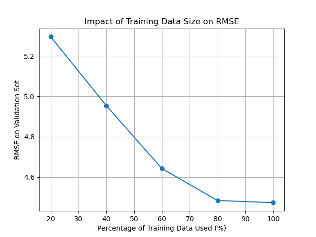
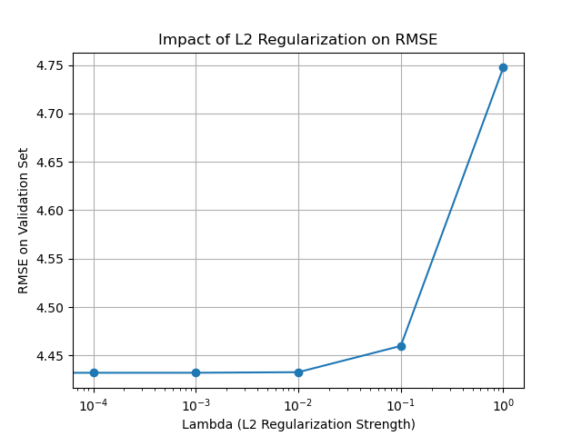

# HW1: PM2.5 Prediction

This project implements a linear regression model from scratch using Numpy to predict PM2.5 levels.

## 1. Feature Engineering and Preprocessing

The process is as follows:
1.  **Data Cleaning**: Loaded `train.csv`, replaced special characters (`#`, `*`, etc.) and 'NR' (No Rain) with 0.
2.  **Data Reshaping**: Converted the time-series data into a format where each row represents a specific hour, and each column represents a weather measurement.
3.  **Core Feature Identification**: Calculated the Pearson correlation between all features and PM2.5. The top 8 most correlated features were selected as core features: `['PM10', 'CO', 'NMHC', 'NO2', 'NOx', 'THC', 'SO2', 'AMB_TEMP']`.
4.  **Candidate Feature Generation**: Based on the 8 core features, generated a candidate pool of 396 features, including original 9-hour data, squared terms, and interaction terms.
5.  **Lasso Feature Selection**: Used `sklearn.linear_model.Lasso` (with `alpha=0.1`) to select the most important features from the 396 candidates. This resulted in a final set of **44** features.
6.  **Standardization**: The final features were standardized using `sklearn.preprocessing.StandardScaler` before training.

## 2. Impact of Training Data Size

An experiment was conducted by training the model on different subsets of the training data (20% to 100%) and evaluating the RMSE on a fixed validation set.

As expected, the model's performance improves (RMSE decreases) as more training data is used. The error rate drops significantly when moving from 20% to 40% of the data, and then continues to decrease more gradually.

## 3. Impact of Regularization

An experiment was conducted to see how L2 regularization affects performance. The model was trained with different lambda values, and the RMSE was evaluated on a fixed validation set.

A small amount of regularization (`lambda=0.001`) appears to provide the best result, preventing overfitting without excessively penalizing the model weights. A lambda of 0 (no regularization) performs slightly worse, and larger lambdas significantly degrade performance.
