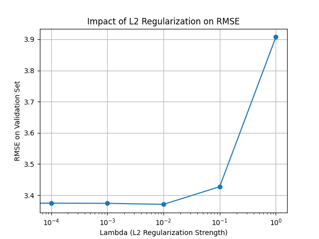
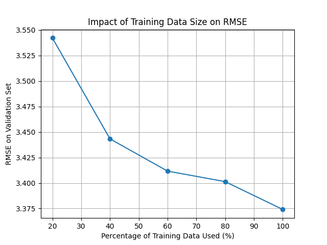

# PM2.5 預測專案報告

## 1. 專案總覽

本專案旨在根據過去9小時的氣象數據，預測未來第10小時的 PM2.5 數值
專案的核心是根據作業要求，僅使用 NumPy 從零開始實作一個線性迴歸模型
整個流程，從數據前處理、特徵工程、模型訓練到最終預測，均封裝在python腳本中

---

## 2. 最終模型與成果

### 最終成果

經過一系列的迭代與優化，最終模型在**本地的時序驗證集**上取得了 **RMSE ≈ 3.30** 的優異成績
此版本的預測結果提交至Kaggle後，獲得了 **3.65551** 的公開榜單分數

### 最佳模型配置

取得上述成果的最佳模型配置如下：

- **核心特徵 (Core Features)**: 手動指定 `['PM2.5', 'PM10', 'O3', 'CO']` (共4個)
- **特徵工程 (Feature Engineering)**: **使用原始特徵 + 平方項** (共 `4 * 9 * 2 = 72` 個)，不含交互項。
- **數據增強 (Data Augmentation)**: **關閉**
- **驗證策略 (Validation Split)**: **時序驗證** (每月前90%數據訓練，後10%驗證)
- **特徵篩選 (Lasso)**:
    - `alpha` (L1 強度): `0.05`
    - `Lasso_Learning_Rate`: `0.01`
- **最終模型 (Ridge)**:
    - `lambda_strength` (L2 強度): `0.001` (來最佳正規化參數搜索的最佳值)
    - `learning_rate` (Adagrad): `0.5`
    - `epochs`: `2000`

---

## 3. 模型演進與調優歷程

本次專案經歷了四個關鍵的探索階段

### 階段一：初步實作與分析 (RMSE ≈ 4.26)

- **做法**: 
    1.  根據最初的 `HW1-PM2.5預測計畫.md` 進行實作
    2.  使用全部18個原始氣象數據作為核心特徵
    3.  特徵工程包含了**原始特徵、二次項和交互項**，候選特徵總數高達1500多個
    4.  啟用數據增強（2倍噪音數據擴充訓練資料）
    5.  驗證集採用**隨機交叉劃分** (`i % 5 != 4`)
- **結果**: 
    此階段在本地驗證集上獲得了約 **4.26** 的 RMSE。雖然分數看似不錯，但後來發現隨機劃分的驗證方式過於樂觀，無法反映模型對未來的真實預測能力

### 階段二：驗證策略的更新 (真實 RMSE ≈ 5.0)

- **做法**: 
    1.  我發現相較於訓練集，測試集屬於**時間上靠後的數據**
    2.  因此將驗證策略修改為**時序驗證**（例如，用每月前80%數據訓練，後20%驗證）
- **結果**: 
    更換為真實的驗證策略後，模型的 RMSE 馬上飆升至 **5.0** 左右
    這揭示了模型的真相：在複雜特徵和數據增強的影響下，模型對訓練集產生了**嚴重過擬合**

### 階段三：去除特徵的組合 (RMSE ≈ 3.37)

- **做法**: 
    1.  **徹底簡化特徵**：核心特徵縮減為4個，且只使用其原始值，完全拋棄二次項和交互項
    2.  **關閉數據增強**：停止使用隨機噪音，只用最乾淨的原始數據訓練
    3.  **精準調參**：在新的簡化設定和時序驗證下，對Lasso和Ridge的參數進行了新一輪的精準搜索
- **結果**: 
    這個少即是多的策略取得了巨大成功
    模型不再被噪音干擾，學到了數據最核心的規律，泛化能力大幅提升
    最終，在最嚴格的時序驗證下，RMSE驟降至 **3.37**
    在Kaggle中獲得了**3.72947**的分數，達成目標

### 階段四：再次進化，重新加入平方項 (RMSE ≈ 3.30)

- **做法**: 
    1.  在階段三的成功基礎上，我們嘗試逐步增加模型複雜度，將**平方項**重新加入特徵工程。
    2.  特徵維度從36維增加到72維。
- **結果**: 
    這個謹慎的調整再次帶來驚喜，證明了數據中確實存在部分非線性關係可以被平方項捕捉，最終將RMSE從3.37進一步降低至 **3.30**
    提交Kaggle後，獲得了 **3.65551**的分數

---

## 4. 如何運行

### 環境需求
- Python 3.x
- NumPy
- pandas
- Matplotlib

### 執行指令

在終端機中執行以下指令即可運行完整的流程：

```bash
python HW1.py
```

腳本會自動完成數據處理、特徵篩選、L2正規化超參數搜索、訓練、並生成最終的 `submission.csv` 文件。

---

## 5. 總結與心得

### 核心問題分析

專案初期，我嘗試透過複雜的特徵組合（大量二次項、交互項）來提升模型效能，但效果始終停滯在一個瓶頸（真實RMSE約 4.X 左右），其根本原因在於：
1.  **資料集規模有限**：
    此處的訓練集在機器學習領域中屬於小型資料集
    在這種情況下，使用上千個組合特徵（參數數量遠超樣本數）會容易出現「維度的詛咒」，模型學到的更多是數據中的噪音，而非真實規律

2.  **組合特徵導致過擬合**：
    平方項與交互項雖然能提升模型複雜度，但在線性模型與小數據的組合下，它們更容易引入冗餘和不穩定性，使模型過度擬合訓練數據，無法泛化到未來的測試數據上

3.  **Lasso未能有效收斂**：
    原本希望使用Lasso從海量特徵中自動篩選出合適的特徵組合，但當候選特徵本身充滿噪音且數量龐大時，配合Adagrad優化器，Lasso很難有效收斂並將無用特徵的權重真正壓至零，導致特徵篩選效果不彰

### 成功關鍵：為何4個原始特徵更好？

最終的突破來自於利用領域知識（Domain Knowledge）選取特徵並大幅簡化模型，其成功關鍵在於：
- **清晰的物理意義**：
    最終選用的特徵為：PM2.5、PM10、CO、O3，其關聯性在環境科學上具有充分的依據
    這相當於由人類專家預先進行了一輪高效且可靠的特徵篩選
- **更強的泛化能力**：
    當特徵維度從數百維降至36維時，模型的複雜度大幅降低
    在小樣本數據上，一個更簡單的模型更容易收斂到一個穩定的解，從而擁有更好的泛化能力

### 最終啟示
本次專案最重要的學習是：
    **在小型資料集上，適度的、有依據的特徵選擇，遠比盲目生成高維特徵更為有效** 
    我最初的計畫試圖在小數據集上強行套用大數據的作法，導致了失敗；
    而最終的成功，則源於對數據和問題本身的深入理解，以最簡單的方式達到了目的

---

## 6. 實驗分析

在python腳本中，額外包含了兩個用於分析模型特性的實驗函數，以回應專案報告的要求

*注意：在最終版本的腳本中，這些實驗默認是關閉的 (`experiment = False`)，以專注於最高效能模型的訓練。若要運行，可將此旗標設為 `True`。*

### L2 正規化強度影響



此實驗旨在探討最終模型中 L2 正規化強度 (`lambda`) 對模型表現的影響

- **目的**：透過遍歷一組 `lambda` 值（例如 `[0, 0.001, 0.01, 0.1, 1]`），我們可以觀察到：
    - 當 `lambda` 過小時，模型可能過擬合，在驗證集上表現較差
    - 當 `lambda` 過大時，模型可能欠擬合，同樣表現不佳
- **作用**：這張圖可以幫助我們找到一個最佳的 `lambda` 值，在「擬合不足」與「過度擬合」之間取得最佳平衡，從而提升模型的泛化能力

### 訓練資料規模影響



此實驗用於視覺化訓練資料的規模對模型準確度的影響
- **目的**：
    透過使用不同比例（例如 20%, 40%, ..., 100%）的訓練數據來訓練模型，並在固定的驗證集上評估其 RMSE
- **作用**：
    生成的圖表通常會顯示一條「學習曲線」，展示了隨著數據量的增加，模型的表現如何提升
    這有助於判斷我們的模型是否能從更多的數據中受益，或者是否在少量數據下就已達到飽和

---

## 7. 未來可優化方向

雖然目前模型已取得不錯的成績，但仍有許多潛在的優化方向值得未來探索：

1.  **嘗試交互項特徵 (Interaction Features)**
    - 當前已經驗證了「原始+平方」特徵的有效性，下一步可以嘗試再次加入「交互項」特徵（例如 `PM10 * O3`），觀察是否能捕捉到更多特徵間的複雜協同關係。但這同時也會增加模型過擬合的風險，需要謹慎調整正規化參數

2.  **跨月份標準化 (Cross-Month Normalization)**
    - 目前的標準化是針對整個訓練集。一個更精細的做法是「按月份獨立進行標準化」。考慮到不同季節（月份）氣象數據的尺度可能存在差異（如冬夏的溫度），獨立標準化或許能更好地消除月份間的數據分佈差異

3.  **加入時間特徵 (Time-Based Features)**
    - 可以從時間戳中提取更多資訊作為特徵，例如：
        - **小時特徵**：將一天24小時作為一個分類特徵，幫助模型捕捉日夜變化的污染模式
        - **平日/週末特徵**：建立一個二元特徵來區分工作日和週末，這可能影響交通和工業污染的規律

4.  **更精細的核心特徵組合**
    - 目前選用了4個核心特徵。但可以進一步實驗不同的特徵組合，例如只用 `PM2.5`, `PM10`, `O3` 這三個關聯性最強的特徵，看看極致簡化是否會有意外的收穫